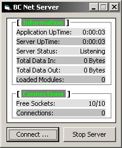



## a \[BCNS\] \- Binary Crew Network Server \(BC Net Server\)

### Description

It is a Server which works with Modules (DLL Files) which were coded for this Server.

The Modules can be loaded and unloaded by the Server. Our first Module is "Comm" for Chat based Communication.

-:::-

*Modules = Plugins (COM/ActiveX DLL);

CreateObject() is used to load Modules.
 
### More Info
 

             |
---                |---
**Submitted On**   |2005-01-08 05:36:08
**By**             |[CodeXP](https://github.com/Planet-Source-Code/PSCIndex/blob/master/ByAuthor/codexp.md)
**Level**          |Advanced
**User Rating**    |4.7 (14 globes from 3 users)
**Compatibility**  |VB 4\.0 \(32\-bit\), VB 5\.0, VB 6\.0
**Category**       |[OLE/ COM/ DCOM/ Active\-X](https://github.com/Planet-Source-Code/PSCIndex/blob/master/ByCategory/ole-com-dcom-active-x__1-29.md)
**World**          |[Visual Basic](https://github.com/Planet-Source-Code/PSCIndex/blob/master/ByWorld/visual-basic.md)
**Archive File**   |[a\_\[BCNS\]\_\-188579582005\.zip](https://github.com/Planet-Source-Code/codexp-a-bcns-binary-crew-network-server-bc-net-server__1-52495/archive/master.zip)

